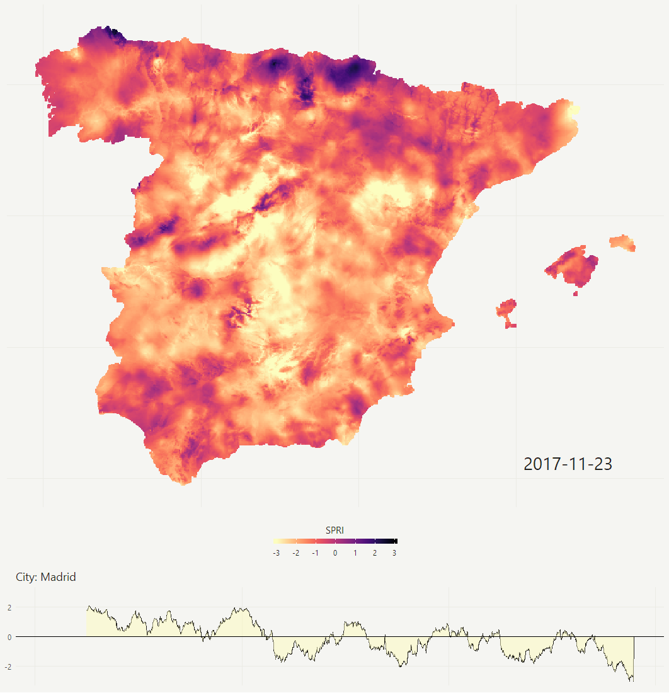

# Drought Indices Map

This project attempts to find an accesible and friendly way to visualize data of drought indices in Spain from 1961 until 2017. The dataset was downloaded from [http://monitordesequia.csic.es](http://monitordesequia.csic.es "http://monitordesequia.csic.es") under the Open Database License. 

The purpose of this project is to summarise in a simple way the information of the dataset and hopefully help to identify interesting climate phenomena during the last 50 years in Spain.

The first attempt was to visualize the SPEI index heatmap and the timeline of a given space point. The following example represents the overall situation on November 2017, and the series of values in the city of Madrid.

## Dataset Desciption

The SPEI index can be downloaded at time scales from 1 to 48 months, and it contains data with a spatial resolution of 1.1 km and at four time steps each month (Days 1–8, 9–15, 16–22, and from Day 23 to the end of the month) that covers the Peninsular Spain and the Balearic Islands (PSBI) (35.75N, 10.24W to 43.99N, 4.13E).

Data is projected in the zone 30 North Universal Transversal Mercator coordinate system using the ellipsoid ED50 ([ED50 / UTM zone 30N](http://spatialreference.org/ref/epsg/ed50-utm-zone-30n/ "ED50 / UTM zone 30N")).  The files are available in Network Common Data Form 4 ([NetCDF4](https://www.unidata.ucar.edu/software/netcdf/docs/netcdf_introduction.html "NetCDF4")) format.

In the case of the heatmap, due to the high amount of points to be drawn and rendered, the map was reduced to a 500x500 grid, with the mean value of the SPEI in each square.

Optionally, a coast map of Spain can be overlaid to get a better localization of each square.

## SPEI Drought Indicator

The SPEI  (Standardized Precipitation Evapotranspiration Index) can measure drought severity according to its intensity and duration, and can identify the onset and end of drought episodes.

The SPEI is really simple to obtain, it is calculated using monthly (or weekly) precipitation as the input data and it uses the monthly (or weekly) difference between precipitation and temperature and potential evapotranspiration (PET). This represents a simple climatic water balance which is calculated at different time scales to obtain the SPEI. 

More information regarding the SPEI and the calculations to obtain it are available at http://spei.csic.es/home.html

## Licenses

The data from the Drought indices dataset for Spain is made available under the [Open Database License](http://opendatacommons.org/licenses/odbl/1.0/ "Open Database License"). Any rights in individual contents of the database are licensed under the [Database Contents License](http://opendatacommons.org/licenses/dbcl/1.0/ "Database Contents License").

What follows is a human-readable summary of the ODbL 1.0 license. Please, read the full ODbL 1.0 license text for the exact terms that apply.
Users of the dataset are free to:

- **Share**: copy, distribute and use the database, either commercially or non-commercially.
- **Create**: produce derivative works from the database.
- **Adapt**: modify, transform and build upon the database.

Under the following conditions:

1. **Attribution**: You must attribute any public use of the database, or works produced from the database, by citing the following paper: [Vicente-Serrano SM, Tomás-Burguera M, Beguería S, Reig-Gracia F, Latorre B, Peña-Gallardo M, Luna Y, Morata A, González-Hidalgo JC. A High Resolution Dataset of Drought Indices for Spain. Data, 2 (3): 22 (2017)](http://www.mdpi.com/2306-5729/2/3/22 "Vicente-Serrano SM, Tomás-Burguera M, Beguería S, Reig-Gracia F, Latorre B, Peña-Gallardo M, Luna Y, Morata A, González-Hidalgo JC. A High Resolution Dataset of Drought Indices for Spain. Data, 2 (3): 22 (2017)"). For any use or redistribution of the database, or works produced from it, you must make clear to others the license of the original database.
2. **Share-Alike**: If you publicly use any adapted version of this database, or works produced from an adapted database, you must also offer that adapted database under the ODbL.

